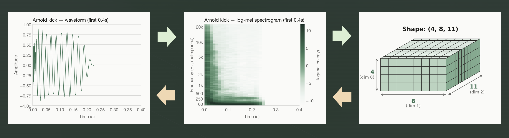

I keep telling my friends who listen to techno that its just a kick drum with reverb on it.

This lighthearted joke is where [KickWithReverb](https://kick-with-reverb.vercel.app) started. So I built a 'Fully Featured DAW for the Average Techno Producer' around that joke. Pick a kick, pick a noise layer, pick a convolution reverb impulse response, twist some knobs, done. You are now a world class techno producer.

This article goes through how I trained and deployed a generative latent diffusion kick drum model from scratch on 13,600 kick drums from my personal sample library on a local linux machine with 6GB of VRAM.

The live app can be found [here](https://kick-with-reverb.vercel.app), the project code on [GitHub](https://github.com/zhinit/KickWithReverb), and the model weights on [HuggingFace](https://huggingface.co/zhinit/kick-gen-v1).

## The Big Picture. 

Diffusion models are most well known for generating images. Maybe you have heard of DALL E 2, or Midjourney. You have probably seen many AI generated images on social media or in the news which were likely generated by a diffusion model. (Alright if we are being exact the latest models are a diffusion llm hybrid)

Diffusion models work by adding random noise to images sequentially a little bit at a time until the image becomes pure noise, then learning to reverse the noise-adding process, one small denoising step at a time. In fact I used a diffusion model to generate the image of the noising/denoising process below.


Similar to how you can add noise to images, you can also add noise to audio files and do the same thing. However, 2 seconds of audio with a 44,100 Hz sample rate is 88,200 samples and running a denoising network on all of them, hundreds of times, is expensive.

So instead of diffusing raw audio, we convert the raw audio to spectrograms, then compress those down to a small "latent" space and diffuse there instead.



- An audio file (left) is a series of numbers which represent the air pressure over time. 
    - A kick drum has a chaotic beginning (the transient) before smoothing out to a sine (the tail)
- A spectrogram (middle) is a representation of the frequencies of a signal as it changes over time.
    - A kick drum starts with a lot of high end frequencies before dampening to a smooth low end tail.
- A latent space is just a compressed representation of something. Here it is a 3D tensor that is 4x8x11. Each number in it doesn't need to mean anything to a human, but it usually ends up capturing a tangible property, since that's the most efficient way to compress it. For example, for a kick drum audio file, one of those values might end up representing the fundamental harmonic, or the decay of the sound, even though nobody explicitly told the model to track "pitch" or "decay".

Note that converting from an audio file to a mel spectrogram is deterministic and does not require a model, but it is not invertible and lossy. Thus we need a model to go from a mel spectrogram back to an audio file.

This gives us three models, with three separate training runs:

1. **The Variational Autoencoder (VAE)**
    - compresses a mel spectrogram of a kick into a latent tensor, and 
    - can decompress a latent tensor back to a mel spectrogram.
2. **Diffusion U-Net:**
    - the actual generative model
    - Learns to turn a latent tensor of random noise into a valid latent tensor
    - optionally steered by a text keyword.
3. **HiFi-GAN vocoder**
    - turns a mel spectrogram back into the final audio waveform you hear

Each of the three models trained for roughly a day on a Linux desktop with a 6GB VRAM card. Not a rented cloud A100. A 10 year old linux machine sitting around my house.


## Data

I have been making music since I was a child and have been producing house music for around 15 years. House music is not much more advanced than techno and is probably 90% just kick and bass. Thus over that time I have collected many kick samples. **A simple grep on my sample library for audio files with 'kick' in the name yields 15,082 files.**

Of course, as with any good data set, I had to do some proper cleaning to prepare my data for training. I pulled every audio file which contained "kick" in the name, and then filtered and prepared the data as follows.
- Filtered out drum loops by removing files with the word "loop" or "BPM"
- Filtered out infeasible file sizes less than 5KB or larger than 1MB

That produced **13,613 kick samples**. Each was renamed with a hash prefix to dodge filename collisions since 2 kicks in different libraries may be named hard_kick_2.wav.

I extracted keywords from the original filenames by splitting on `-`, `_`, spaces, and dots, then lowercasing everything. 

Finally, I wanted all samples to be the same format so every sample was
- resampled to 44.1kHz
- padded or trimmed to exactly 2 seconds
- normalized to -1dB peak
- given a 0.2 second fade-out
- converted to a log-mel spectrogram
    - (128 mel bins, 2048-point FFT, 512 hop length)

The result is a 128x173 log-mel spectrogram for each kick.

### Why log-mel spectrograms?

A log-mel spectrogram is just a regular spectrogram with two adjustments, one to the frequency axis and one to the amplitude axis. Each adjustment solves its own problem.

First, why a spectrogram at all. A single FFT over the whole file would tell you which frequencies are present but not when they happen, and a kick drum is all about when. The click, the pitch sweep, and the decaying body all happen in a specific order. So instead we slide a short window across the audio and FFT each slice, giving us frequency content over time.

The problem with a plain spectrogram is where it spends its resolution. A 2048-point FFT produces 1025 evenly spaced frequency bins, and most of those bins cover high frequencies where a kick drum has almost nothing going on.

The **mel** scale fixes the frequency axis. Human hearing is roughly logarithmic in frequency. 60Hz vs 120Hz is a huge difference, while 10,000Hz vs 10,060Hz is imperceptible. Kick drums also concentrate their energy in the low end, exactly where our ears are pickiest. The mel scale spaces bins the way ears do, dense in the lows and sparse in the highs. This collapses 1025 linear bins down to 128 mel bins without losing the detail that matters. It also shrinks the input the VAE has to learn, which my 6GB card appreciated.

The **log** fixes the amplitude axis. A kick's transient is orders of magnitude louder than its tail. If you compute a loss on raw mel values, the transient dominates the error term and the model effectively ignores the rest of the sound. Taking the log (`torch.log(mel.clamp(min=1e-5))`) brings the loud and quiet parts onto a comparable scale, so the model learns the whole kick and not just the initial hit.

So it is not mel vs log. They solve different problems on different axes. Mel fixes frequency, log fixes amplitude, and log-mel is both.

## The VAE

The encoder is 4 downsampling stages of strided convolutions and residual blocks. It takes the `(1, 128, 173)` spectrogram down to a `(4, 8, 11)` latent, which is 352 floats. That is about a **63x compression** of the original spectrogram. The decoder mirrors the encoder to go back up.

```
loss = MSE(recon, target) + L1(recon, target) + kl_weight * KL_divergence
```

The KL term is what makes it a *variational* autoencoder instead of a plain one. It pushes the latent space toward a well behaved distribution rather than a scattered mess. This matters because the diffusion model will later generate brand new points in this space, and decoding those points needs to produce something coherent.

I annealed the KL weight up slowly over the first 20 epochs (0.0001 to 0.001). If you turn it up too aggressively too early, the model gives up on encoding any real information into the latent at all. This is a well known failure mode called posterior collapse, where the decoder learns to ignore the latent and output an "average" reconstruction no matter the input.

Training was 100 epochs at batch size 32 with mixed precision, which took about a day on the 6GB card.

## The diffusion model

This is the actual generative model. It never touches raw audio, only `(4, 8, 11)` latents.

**Down path:**
```
Conv2d(4, 64) -> CondResBlock(64)              -> (64, 8, 11)
Conv2d(64, 128, stride=2) -> CondResBlock(128) -> (128, 4, 6)
Conv2d(128, 256, stride=2)                     -> (256, 2, 3)
```
**Middle:** CondResBlock(256) -> SelfAttention2d(256) -> CondResBlock(256)
**Up path** mirrors the down path with skip connections.

The "Cond" in CondResBlock is where conditioning gets injected. A sinusoidal timestep embedding (which noise step we're at) and a text embedding (which keywords were requested, if any) get summed and fed into every residual block.

Training uses a linear noise schedule over 1000 timesteps. At each training step, the model is given a noisy latent, the timestep, and the keyword embedding, and it predicts the noise that was added.

15% of training samples have their keywords dropped entirely, which teaches the model to also generate unconditionally. This matters for classifier-free guidance (CFG). At inference time you run the model once with your keywords and once with no keywords, then push the output further in the direction the keywords moved it. A `cfg_scale` of 1.0 ignores the prompt entirely and 3.0 is a reasonable default. Cranking it past 5 gets you strong prompt adherence at the cost of variety, i.e. everything starts sounding the same.

Training was 100,000 iterations at batch size 16 with gradient accumulation of 2 and EMA decay of 0.9999. Again, about a day on the 6GB card.

## The vocoder

A mel spectrogram is not audio. The conversion from audio to mel spectrogram threw away phase information, so there is no exact way back to a waveform, only estimates.

The cheap option is Griffin-Lim, an iterative algorithm that estimates phase mathematically. It works but sounds noticeably washed out. The better option is a neural vocoder, so I trained a HiFi-GAN generator. It upsamples in five stages (8x, 8x, 2x, 2x, 2x) for a total of 512x, which matches the hop length, with residual blocks at each stage. It trains adversarially against a multi-period discriminator and a multi-scale discriminator.

```
loss_g = adversarial_loss + 2.0 * feature_matching_loss + 45.0 * mel_reconstruction_loss
loss_d = LS-GAN discriminator loss (real vs fake)
```

GANs are notoriously unstable to train, so this one ran in full fp32 since mixed precision tends to destabilize adversarial training, and with a smaller batch size than the other two components. 50 epochs, roughly a day.

## Training config, all three components

| Component | Iterations | Batch size | Precision | Wall clock (6GB card) |
|---|---|---|---|---|
| VAE | 100 epochs | 32 | fp16 | ~1 day |
| Diffusion U-Net | 100,000 steps | 16 (x2 accum) | fp16 | ~1 day |
| HiFi-GAN vocoder | 50 epochs | 4-8 | fp32 | ~1 day |

Three separate training runs, three separate days, all on the same desktop. Nothing touched a cloud GPU until inference time.

## Text conditioning: a dead end

The plan was to let users type keywords like "punchy" or "808" and get a kick that matched. The vocabulary comes straight from the filename keywords I extracted earlier, filtered to anything appearing 5 or more times. Here is the problem, straight from `metadata.csv`

| keyword | count |
|---|---|
| kick | 10,680 |
| dt01 | 1,673 |
| wadm | 1,569 |
| m | 1,087 |
| wasd | 1,073 |
| clean | 751 |
| promachines | 705 |
| tape | 464 |
| warm | 459 |
| 808 | 409 |
| hard | 360 |
| house | 190 |
| punchy | 206 |
| hit | 50 |

Producers do not name their samples descriptively. They name them after the sample pack, the plugin, a project code, or nothing at all. `dt01`, `wadm`, and `wasd` are meaningless pack prefixes with more occurrences than `punchy`. Out of 5,228 unique keywords, the semantically meaningful ones are a small minority buried under noise.

Free-text conditioning technically worked, i.e. the model does respond to keywords. But in practice, most keyword combinations a real user would type returned metallic sounding garbage because the model had never seen enough clean examples of that concept to learn it well. I tried a handful of keywords by ear and found a couple that reliably produced decent kicks. So I hardcoded those server-side instead of exposing a text box.

```python
def generate_kick(
    self, prompt: str = "hit house", cfg_scale: float = 3.0, steps: int = 50
) -> bytes:
```

No user-facing prompt field. Just a button that calls `generate_kick()` with a prompt I already know sounds good. Sometimes the fix for "the model doesn't generalize well to arbitrary input" is to not let the input be arbitrary.

## There are still artifacts, and I kind of like them

On their own, the generated kicks sound decent. But once you start heavily compressing and distorting them, which is exactly what the app's DSP chain does, you can hear a subtle granularization underneath. The kick sounds like it is built out of tiny grains instead of one continuous transient. This is a real artifact of the generation pipeline, probably some combination of the vocoder upsampling and the 63x latent compression losing fine detail that heavy compression later reveals.

It is a flaw, but pushed hard enough it starts to sound like its own texture rather than a mistake. That works for a project whose entire premise is smashing a kick drum until it sounds cool.

## Shipping it

Training happens once, locally. Inference needs to happen on demand for anyone using the live app, without me paying for a GPU that sits idle 24/7. This is a serverless GPU problem, and I used [Modal](https://modal.com) for it.

The weights (about 350MB across the three checkpoints) live on HuggingFace, not in the Django repo or the Modal image. On first boot, the worker downloads them into a Modal Volume that acts as a persistent cache, so subsequent cold starts skip the download.

The important architectural decision is using a class-based Modal app instead of a plain function:

```python
@app.cls(
    image=image,
    gpu="T4",
    volumes={"/cache": volume},
    scaledown_window=300,  # Keep GPU warm for 5 minutes
    timeout=600,
)
class KickGenerator:
    @modal.enter()
    def setup(self):
        # runs ONCE when the GPU boots, load all 3 models here
        ...

    @modal.method()
    def generate_kick(self, prompt="hit house", cfg_scale=3.0, steps=50) -> bytes:
        # runs on EVERY call, reusing what setup() already loaded
        ...
```

`@modal.enter()` runs once per container boot and loads all three models onto the GPU. `generate_kick` then runs per request against models that are already sitting warm in memory. If this were a plain `@app.function`, you would pay the full model load cost (download weights, deserialize, move to GPU) on every single call instead of once per container lifetime.

`scaledown_window=300` keeps a container alive for 5 minutes after the last request. Back to back generations hit a warm container and take about 10 seconds each. The first request after 5 minutes of silence eats a cold boot, which is closer to 60 seconds while the T4 spins up and the models load.

Django talks to the worker via `modal.Cls.from_name("kick-generator-app", "KickGenerator")`, uploads the returned WAV bytes to Supabase Storage, and hands the frontend a public URL.

Rate limits exist purely to keep GPU costs bounded on what is, at the end of the day, a side project. Each user gets 10 generations per day and can store 30 kicks total, past which they have to delete old ones to make more.

One last detail worth calling out. The fade-out applied to every generated kick is not just polish. It exists because of the artifact problem above.

```python
# Exponential fade-out (1.0s to 1.75s) + silent tail (1.75s to 2.0s).
# Exponential curve (power=3) drops fast then tapers, keeping OTT from
# re-amplifying the tail. 0.25s of hard silence lets OTT fully release.
fade_start = int(1.0 * SAMPLE_RATE)
fade_end = int(1.75 * SAMPLE_RATE)
fade_samples = fade_end - fade_start
if fade_start < waveform.shape[-1]:
    fade = torch.linspace(1.0, 0.0, fade_samples, device=waveform.device) ** 3
    waveform[..., fade_start:fade_end] *= fade
    waveform[..., fade_end:] = 0.0
```

A compressor works by turning quiet things up. If the generated kick has any low level noise trailing off into silence, a multiband compressor downstream will happily amplify that noise back up into something audible. So the fade has to actually reach true zero and stay there. Otherwise the DSP chain will find the artifact and turn it into a feature nobody asked for.

## Key takeaways

- **Diffuse in latent space, not raw audio.** Compressing 88,200 audio samples down to a 352 float latent is what made training on a 6GB card feasible at all.
- **Training data determines what conditioning can actually learn.** Real world filenames are pack prefixes and project codes, not adjectives. If your vocabulary is mostly noise, free-text conditioning will mostly disappoint. Sometimes the practical fix is picking good defaults instead of exposing the knob.
- **A flaw discovered downstream can be fixed upstream.** The granularization artifact only shows up once the DSP chain compresses hard, and the fade-out that keeps compressor noise in check has to happen at generation time, not in the DSP engine.
- **Class-based serverless functions exist for a reason.** Loading 350MB of model weights on every request would make every generation unbearably slow. Load once in `@modal.enter()`, serve many times.

I hope you found this useful, and if you want to hear what a diffusion model thinks a kick drum sounds like, go smash the 🎨 button.
