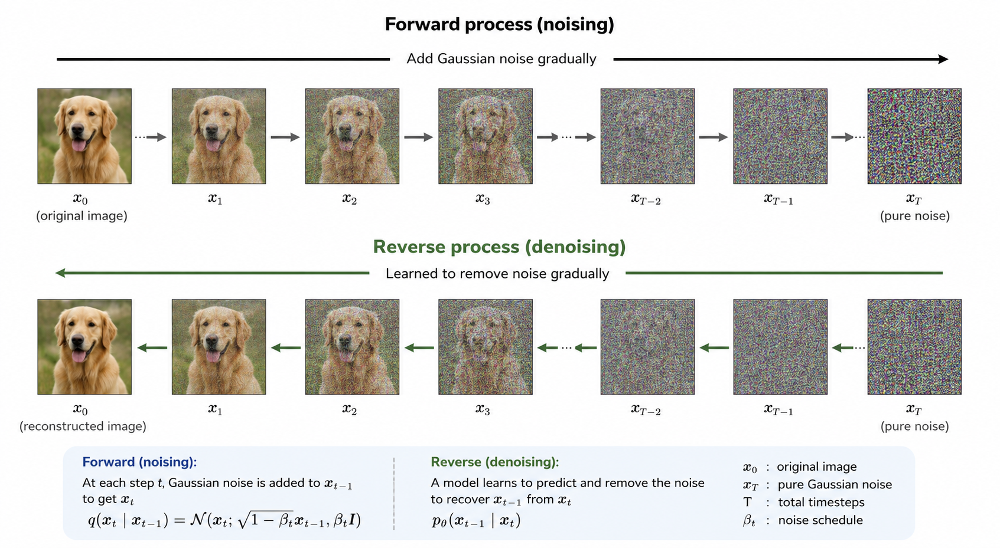
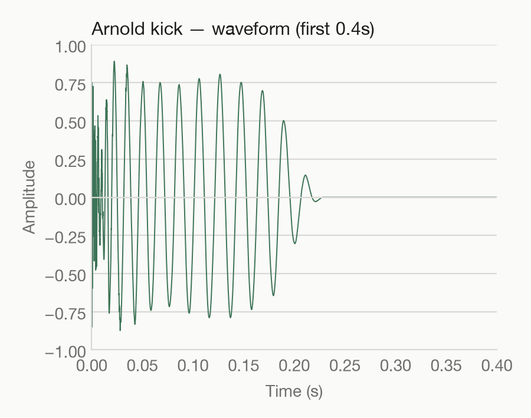
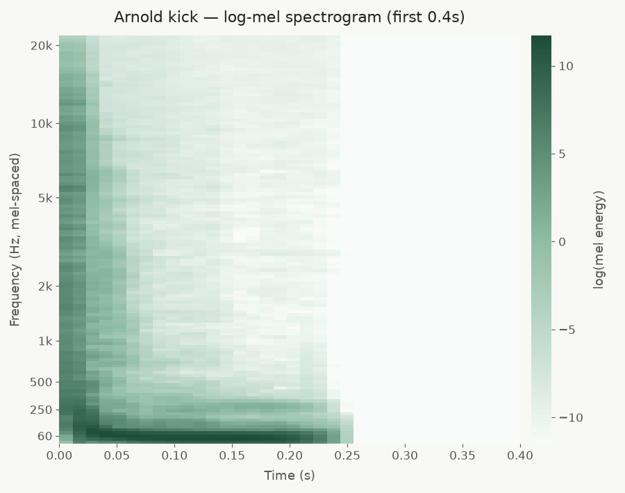
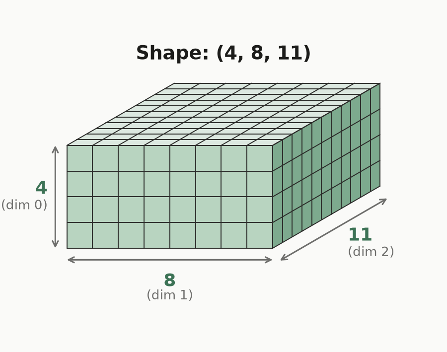
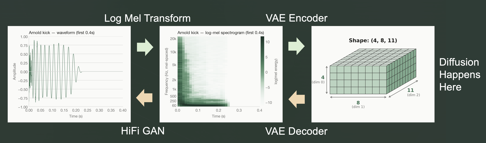

I keep telling my friends who listen to techno that its just a kick drum with reverb on it.

This lighthearted joke is where [KickWithReverb](https://kick-with-reverb.vercel.app) started. So I built a 'Fully Featured DAW for the Average Techno Producer' around that joke. Pick a kick, pick a noise layer, pick a convolution reverb impulse response, twist some knobs, done. You are now a world class techno producer.

This article goes through how I trained and deployed a generative latent diffusion kick drum model from scratch on more than 13,000 kick drums from my personal sample library on a local linux machine with 6GB of VRAM.

The live app can be found [here](https://kick-with-reverb.vercel.app), the project code on [GitHub](https://github.com/zhinit/KickWithReverb), and the model weights on [HuggingFace](https://huggingface.co/zhinit/kick-gen-v1).

## The Big Picture. 3 Representations. 3 Models. 1 Pipeline 

Diffusion models are most well known for generating images. Maybe you have heard of DALL E 2, or Midjourney. You have probably seen many AI generated images on social media or in the news which were likely generated by a diffusion model. (Alright if we are being exact the latest models are a diffusion llm hybrid)

Diffusion models work by adding random noise to images sequentially a little bit at a time until the image becomes pure noise, then learning to reverse the noise-adding process, one small denoising step at a time. In fact I used a diffusion model to generate the image of the noising/denoising process below.



Similar to how you can add noise to images, you can also add noise to audio files and do the same thing. However, 2 seconds of audio with a 44,100 Hz sample rate is 88,200 samples and running a denoising network on all of them, hundreds of times, is expensive.

So instead of diffusing raw audio, we convert the raw audio to spectrograms, then compress those down to a small "latent" space and diffuse there instead. An explanation and image of each of those 3 pieces is provided below.

- The raw audio file is a series of numbers which represent the air pressure over time. A kick drum has a chaotic beginning (the transient) before smoothing out to a sine (the tail)



- A spectrogram is a representation of the frequencies of a signal as it changes over time. A kick drum starts with a lot of high end frequencies before dampening to a smooth low end tail.



- A latent space is just a compressed representation of something. Here it is a 3 dimensional tensor that is 4x8x11. Each number inside it doesn't need to mean anything to a human, but it can end up capturing a tangible property, since that's the most efficient way to compress. For example, for a kick drum audio file, one of those values might end up representing the fundamental harmonic, or the decay of the sound, even though nobody explicitly told the model to track "pitch" or "decay".

*Note 'Tensor' is just a fancy word for a multidimensional array*



This gives us three models, with three separate training runs

1. **The Variational Autoencoder (VAE)**
    - compresses a mel spectrogram of a kick into a latent tensor, and 
    - can decompress a latent tensor back to a mel spectrogram.
2. **Diffusion U-Net:**
    - the actual generative model
    - Learns to turn a latent tensor of random noise into a valid latent tensor
    - optionally steered by a text keyword.
3. **Vocoder (HiFi-GAN)**
    - turns a mel spectrogram back into the final audio waveform you hear

Each of the three models was trained on a 10 year old Linux desktop I have sitting around with 6GB VRAM. Not a rented cloud A100. So, yes you can train good models even if you dont have a billion dollar budget.

To put everything together, the diagram below should help you understand the entire process. The top of the diagram is used for training, and the bottom is used for generating kick after it starts from a random latent tensor.

*Note that converting from an audio file to a mel spectrogram is deterministic and does not require a model, but it is not invertible and is lossy. Thus we need a model to go from a mel spectrogram back to an audio file.*



## Data

I have been making music since I was a child and have been producing house music for around 15 years. House music is not much more advanced than techno and is probably 90% just kick and bass. Thus over that time I have collected many kick samples. A simple grep on my sample library for audio files with 'kick' in the name yields 15,082 files.

Of course, as with any good data set, I had to do some proper cleaning to prepare my data for training. I pulled every audio file in my sample library which contained "kick" in the name, and then filtered and prepared the data as follows.

### Filtering

- I filtered out drum loops by removing files with the word "loop" or "BPM"
- I filtered out infeasible file sizes less than 5KB or larger than 1MB

This produced **13,613 kick samples**. 

### Hash Prefix

All 13,613 kicks get copied out of their nested folders into one flat training folder. Producers tend to use similar naming conventions when cranking out a bunch of kicks to put in their pack, so you might end up with 10 sample packs using the exact name hard_kick_2.wav.

To avoid naming colisions each file was renamed with a 6 character hash prefix, like `a3f9c1_hard_kick_2.wav`.

### Keywords

I wanted to make it so the model could take descriptive keywords to make your desired kick. The only text I had readily available to use as data was the file names. So I extracted keywords from each original filename by splitting on `-`, `_`, spaces, and dots, then lowercasing everything and dropping pure numbers and single characters.

For example Hard_Kick_808-Warm.wav becomes `hard, kick, 808, warm`.

### Reshaping

Now all the kicks in my library were different lengths. Also sometime producers forget to normalize their samples when exporting them so the samples are much quieter than others. Thus i normalized all the samples to be the same format as follows.

- resampled to 44.1kHz
- padded or trimmed to exactly 2 seconds
- normalized to -1dB peak
- given a 0.2 second fade-out
- converted to a log-mel spectrogram

The result is a 128x173 log-mel spectrogram for each kick. The next 3 sections explain what that means and where those numbers come from.

### What Exactly is a Spectrogram?

An FFT (Fast Fourier Transform) takes a chunk of audio and tells you which frequencies are in it. A single FFT over the whole file would tell you which frequencies are present but not when they happen, and a kick drum is all about when. The transient and the decaying body happen in a specific order. If the frequencies were to play in a different order, you would get a completely different sound.

To address this we slide a short window across the audio and FFT each slice. Here that window is 2048 samples (about 46ms) and it jumps forward 512 samples at a time (about 11.6ms). Consecutive windows overlap and nothing falls in the cracks. Stack the slices side by side and you get frequency content over time i.e. a spectogram.

Hopping 512 samples at a time through 2 seconds of audio gives 173 slices, which is where the 173 in 128x173 comes from.

### What is the Log Scale?

On a linear scale, equal steps add: 100, 200, 300, 400.\
On a log scale, equal steps multiply: 100, 200, 400, 800.

Human hearing is roughly logarithmic. Doubling a frequency always sounds like the same jump of one octave, whether that is 60Hz to 120Hz or 5,000Hz to 10,000Hz. 

A bass player jumping one octave could be from 60Hz to 120Hz which is a huge difference. However, a bird singing one note vs a mildly off pitch note could be 2,000Hz vs 2,060Hz which is pretty much imperceptible. When was the last time you noticed a bird that needed the help of auto-tune?

Loudness works the same way, which is why volume is measured in dB (a log unit) instead of raw air pressure.

### What is the Mel Scale?

The mel scale is the fix for the frequency axis. It is pretty much the log scale with a fix for the low end.

A pure log scale misbehaves down low. On a true log axis, 5Hz to 10Hz is the same size step as 800Hz to 1,600Hz, and as you approach 0Hz the scale stretches out to infinity. A spectrogram needs bins that go all the way down, so pure log spacing would waste resolution on sub frequencies we cannot hear. It turns out our ears are not actually logarithmic all the way down. 

The mel scale came from experiments where people were asked to judge equal pitch distances. In other words, it spaces frequency bins the way ears do.

### Why a Log-Mel Spectrogram?

The mel scale fixed the frequency axis, and the log scale fixed the amplitude axis. 

So mel and log solve different problems on different axes.\
Log-mel fixes both.

## Models

### The Variational Autoencoder (VAE)

An autoencoder is two networks glued together. An encoder squishes the input down to a small latent tensor, and a decoder tries to rebuild the original from the latent tensor. Both are trained together using their reconstruction error, and the latent tensor is intentionally too small to memorize the input. This forces the encoder to keep the most essential information.

Here the encoder is 4 downsampling stages of strided convolutions and residual blocks. It takes the 128x173 spectrogram, which is 22,144 floats, down to a 4x8x11 latent, which is 352 floats. That is more than 63x compression from the original spectrograms and 250x compression from the original 2 second audio files. 

The decoder mirrors the encoder to go back up.

The problem with a plain autoencoder is that only the latent points it saw during training are guaranteed to decode propperly. The space between those points is lawless. If you feed the decoder a latent it has never seen, you wil most likely get garbage. 

To solve this we can introduce variation. Which gives us a Variational AutoEncoder (VAE).
This is accomplished in 2 pieces.

1. The encoder outputs 2 tensors. One is for the mean, and the other is for the variance. During training the decoder rebuilds from a random tensor which is created based on those means and variances element-wise. This makes it so the decoder learns what a whole neighborhood should decode from a single kick.

2. A KL divergence penalty is added to the training process. The KL Divergence measures how far each mean and variance is from a standard normal distribution (mean = 0, variance=1). So every kick gets dragged toward the same center and forced to keep a neighborhood fat enough to overlap with its neighbors.

The KL penalty and reconstruction error fight each other.
- The reconstruction error would like simply use the original mean and variance 0
- The KL penalty would like to simply use mean = 0 and variance = 1

If KL wins too early the encoder just outputs mean 0 variance 1 for everything and stops encoding the kicks at all (this is called posterior collapse). To address this, I ramped the KL weight up slowly over the first 20 epochs (0.0001 to 0.001), letting the model learn to reconstruct first and tidy up the space second.

The result is a latent space where nearby points decode to similar sounds, and all the kicks live in one known region around the origin instead of scattered islands. This is exactly what the diffusion model needs, since it starts from random noise and wants everywhere it can land to decode into something reasonable.

### The Diffusion Model (U Net)

This is the actual generative model. It never touches raw audio, only 4x8x11 latents.

Take a kick's latent, add a known amount of random noise to it sequentially for 1,000 steps then train the model to remove the noise at each step. For reference this is what was discussed at the top of this article. The image is below again for reference.


Instead of using photos of dogs we are doing this on our latent kick drums.

It's somewhat interesting the entire process is shaped like a U, the VAE is shaped like a U and the difusion is shaped like a U, so we have some sort of U shaped fractal motif going on here. 

While denoising, the model uses 2 extra pieces of info.

1. How deep into the 1,000 noise steps it currently is. Because brushing a little dust off a nearly finished kick is a different job than digging one out of pure static.
2. The keywords. This allows for "808" to pull the result in a different direction than "tight".

The keywords also use a slick trick. Training samples have their keywords hidden with 15% probability. This forces the model to also learn what a generic kick looks like with no guidance at all.

This pays off at generation time because we run the model twice, once with the keywords and once without. The difference between the two answers is the direction the keywords are pulling. You can use that to exaggerate the pull as much as you want. This is called classifier-free guidance (CFG), and the amount of pull is called cfg scale. At 1.0 the keywords do nothing, and past 5 every "tight" kick starts sounding like the same tight kick. I used 3.0.

### The Vocoder (HiFi-GAN)

Once we have generated a random latent tensor, used diffucsion to denoise that to a kick tensor, and used the VAE decoder to get a mel spectogram, we still need to convert the mel spectogram to audio. Recall the process of converting audio to a mel spectogram is not invertible and is lossly.

So our ideal model to go back to audio has to fill in fine detail while staying faithful to the spectrogram. A model that does this job is called a vocoder, and I used a GAN for it.

*Fun fact: The original vocoder (short for voice encoder) was created by Homer Dudley at Bell Labs in the 1920s to compress speech into fewer frequency bands, so long distance telephone lines could carry it with less bandwidth. An improved version was later used to scramble transatlantic calls between Churchill and Roosevelt during World War 2, and decades after that producers repurposed it into the robot voice effect you know from Imogen Heap. [A brief history of the vocoder](https://www.izotope.com/community/blog/a-brief-history-of-the-vocoder)*

A GAN (Generative Adversarial Network) is 2 models trained as opponents. The generator makes fake audio files, and a discriminator learns to tell the fakes audio files apart from the real training data. Every time the discriminator catches a fake, the generator gets a little better at faking, which forces the discriminator to get a little better at catching the fakes. Repeat this process on & on until the fakes are good.

This works well for the vocoder because there is no formula for what the missing fine detail should be. The best definition we have is "it should sound real", and a discriminator can learn to judge that. The generator also gets penalized for how far its output drifts from the original audio, so it can't just make convincing sounds that have nothing to do with the input spectrogram.

Specifically I trained a HiFi-GAN, an architecture built for exactly this mel-spectrogram-to-audio job. If you are interested here is the original [paper](https://arxiv.org/abs/2010.05646) and [github](https://github.com/jik876/hifi-gan). The generator upsamples the spectrogram in five stages (8x, 8x, 2x, 2x, 2x) for a total of 512x, turning each spectrogram slice back into the 512 audio samples it originally summarized (remember the hop length).

One last note. GANs are notoriously unstable to train. Two models actively fighting each other will do that. So the vocoder is the only one of the three models I trained at full precision (fp32), since the shortcut of training at lower precision tends to destabilize the fight.

## The Full Pipeline, One More Time

I know that was a lot of info, but congrats on making it here!\
Now you that know the whole training pipeline, here is the diagram from the top of the article again.


Training walks the top path. Every kick in the library becomes a mel spectrogram, the VAE encoder compresses that into a latent tensor, and the diffusion model learns its denoising job inside that latent space.

Generating a kick walks the bottom path. Start from a random latent tensor, let the diffusion model denoise it into a kick latent, decode that into a mel spectrogram with the VAE decoder, and hand the spectrogram to the vocoder for the final audio.

Each of the three models took roughly a day to train, three separate runs on the same 10 year old desktop. 

## Text conditioning

The plan was to let users type keywords like "punchy" or "909" and get a kick that matched. The vocabulary comes from the filename keywords I extracted earlier, filtered to anything appearing 5 or more times. Here are counts of some of the keywords.

| keyword | count |
|---|---|
| kick | 10,680 |
| clean | 751 |
| tape | 464 |
| warm | 459 |
| 808 | 409 |
| hard | 360 |
| 909 | 224 |
| punchy | 206 |
| house | 190 |
| hit | 50 |
| techno | 39 |


The model did respond to keywords. The problem was that a lot of keywords responded back with garbage, probably because there just was not enough training data behind them. For example "techno" only appears in 39 of the 13,613 filenames, and produced undesirable harsh metallic kicks. The keyword this entire app is themed around was not a good one.

So I took a practical approach. I tested keywords by ear until I found ones that consistently generated nice sounding kicks, and "hit house" was the winner. Instead of giving users a text box, the generate button just always asks for that.

```python
def generate_kick(
    self, prompt: str = "hit house", cfg_scale: float = 3.0, steps: int = 50
) -> bytes:
```

## There are some artifacts, but they sound kind of good?

On their own, the generated kicks sound decent. But once you start heavily compressing them with the OTT knobs, you can hear some granularization. The kick sounds like it is built out of tiny grains instead of one continuous sound. This is an artifact of the generation pipeline. It's probably some combination of the vocoder upsampling and the 63x latent compression losing fine detail that heavy compression reveals.

It is a flaw, but it sounds like its own texture rather than a mistake. That works for a project whose entire premise is smashing a kick drum until it sounds cool.

## Shipping it

Training happens once, locally. Inference needs to happen on demand for anyone using the live app, without me paying for a GPU that sits idle 24/7. This is a serverless GPU problem, and I used [Modal](https://modal.com) for it.

*note that inference is just a fancy way to say generation*

Serverless GPU means you do not rent an entire GPU, you rent seconds on a GPU. When a request comes in, the provider boots up a docker container on one of their GPUs, runs your code, and bills you for the seconds it ran. When nobody is generating kicks, there is no machine and no bill. For a side project where the generate button might get pressed 50 times one day and 0 times the next, this is the setup that makes sense.

The catch is the boot. Before the worker can generate anything it has to load all three models onto the GPU, and the weights are about 350MB. Doing that for every single kick would be painful. So the worker is set up as a class instead of a plain function. A class gets a setup step that runs once when the container boots, loads the models, and keeps them sitting in GPU memory. Every generation after that reuses what is already loaded. The container also stays alive for 5 minutes after the last request before scaling back down to zero.

This gives generation 2 speeds. If the container is already warm, a kick takes about 2.5 seconds, but if nobody has generated for a while, the first request eats the cold boot, which is closer to 10 seconds. The weights live on HuggingFace and get cached to the modal machine on first download, so even cold boots skip the 350MB download after the very first one.

Here is the full path when you press the GEN button.

1. The frontend asks the Django backend for a new kick.
2. The backend checks the rate limits.
3. The backend asks the Modal worker for a kick and gets back a finished WAV file.
4. The backend uploads the WAV to Supabase BLOB Storage, gives the kick a German name, and saves a record to PostgreSQL.
5. The backend responds to the frontend with a public URL, and the kick shows up in your library ready to play.

I added rate limits exist to keep GPU costs under control and keep load times quick when switching between kicks in the UI. Each user gets 10 generations per day and can store 30 kicks total, past which they have to delete old ones to make more.

## Key takeaways

- **Diffuse in latent space, not raw audio.** Compressing 88,200 audio samples down to a 352 floats is what makes inference fast and training on 6GB of VRAM possible.
- **Training data determines what conditioning can actually learn.** Real world filenames are pack prefixes and project codes, not adjectives. If your vocabulary is mostly noise, free-text conditioning will mostly disappoint. Sometimes the practical fix is picking good defaults instead of exposing the knob.
- **A flaw discovered downstream can be fixed upstream.** The granularization artifact only shows up once the DSP chain compresses hard, and the fade-out that keeps compressor noise in check has to happen at generation time, not in the DSP engine.
- **Class-based serverless functions exist for a reason.** Loading 350MB of model weights on every request would make every generation unbearably slow. Load once in `@modal.enter()`, serve many times.

I hope you found this useful, and if you want to hear what a diffusion model thinks a kick drum sounds like, go smash the GEN button.
